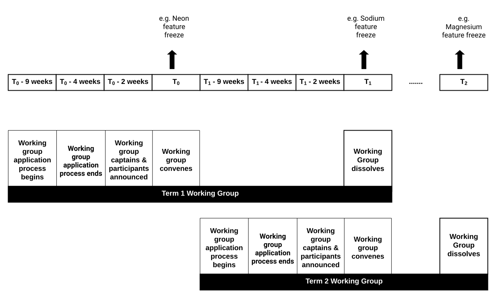

- Feature Name: Working Group
- Start Date: 2019-05-16
- SEP Status: Draft
- SEP PR: (leave this empty)
- Salt Issue: (leave this empty)

# Summary
[summary]: #summary

Engage with Salt community to get feedback on working group 

# Motivation
[motivation]: #motivation

Salt's first working groups will convene by mid of June 2019. In order to benefit the participants of current and future working group as well as those administering them, all the details of working group will be added as a README document in saltstack/salt/community/working-group folder. 

# Working Groups 

A Working Group is a small group of individuals who come together with a common goal and work towards achieving that goal within a predetermined amount of time. It’s an opportunity for Salt community to lead Salt projects and be part of the process in its entirety. 

## Eligibility to participate 

Salt community members are eligible to be part of working group. A community member is one who is interested in working for Salt project exhibited by raising either 1 or more PR(s), issue(s) or a SEPs (Salt Enhancement Proposal) 

In addition, working group applicant is a Subject Matter Expert (SME) in areas such as Windows, Cloud, Networking or SSH 

If you want to lead or be part of a different working group then the ones mentioned above, Salt would be happy to include that as part of initial working groups, provided salt receives enough interest from others to participate. 

## Application Process

Salt Community members indicate their interest to be part of working groups by filling an application consisting of simple 4-5 questions survey; Applicants indicate their preference to the type of working groups they want to join and role they want to play- Captain or facilitator. If an application is received past the due date then the applicant will automatically be considered for the next term of the working groups. 

## Election 

Salt will conduct an election to choose the working group members in below scenarios: 
- When the number of applicants interested to join the working groups exceeds the number that is ideal for a working group (3 to 9 members) 
2 or more community members indicate their interest to be captains 
- If Salt doesn’t receive any eligible applicants wanting to be captain, Salt Open/core team members will be elected to be captain of that working group. 

The rules of the election process are as below:  
- For the first term of working groups, election process will be internal and voting will be done by the salt core team. 
- For the second and later terms of working group, the previous working group members who aren’t participating in the next term will get to vote on participants and the captains

## Timelines 

Based on the applications submitted, salt chooses the final working group members 

Below is the approximate guidelines for how long each working group term last. The actual timelines might differ. For e.g. Testing and Release Working Group might decide to convene immediately after a major release and dissolve after the next major release. 

*T0 is feature freeze date of current major release
 T1 is feature freeze date of next major release

Working Groups will meet once a month for 60 mins. Below are some guidelines to working group participants although each of these groups may operate a little differently depending on their needs and workflow.

## Working Group Structure  

Each working group will have folks participating in 3 types of roles: Captain, Participant and Facilitator. 

### Captain

Each working group’s captain will help lead their respective working group. 

#### Role of Captains
- The captain helps shepherd a subset of features/critical fixes for a given release
- Captain will help coordinate other contributors' work in their area
- Captains will attend monthly working group meetings for their respective working group. SaltStack will set these up, but SaltStack will hold no restriction on a Captain's wish to hold any additional meetings with their respective working group
- Single review completed by the captain on the PR will be considered as criteria met to merge the PR (No additional reviews required) 

#### Captain Guidelines

- Captain will have merge rights to Salt once a PR has been reviewed and approved
- A captain of one working group cannot be captain of any other salt working groups. But captain can be a participant of other working groups 
- Captain can vote to choose the captain and/or participants of next term working group
- Captains have a 3 successive term limit. Captains can take a gap after their 3 successive terms and come back to be a captain after a gap term
- Starting from 2nd term working groups, the captains chosen need to have been a participant in at least one working group 
- Once a captain’s term end and they are no longer the captain of the next term, their merge rights will be rescinded and transferred to new/incoming captain of the working group 
- Captain’s need to follow the [Merging Guidelines](https://github.com/saltstack/salt-enhancement-proposals/); This is to ensure Salt project grows responsibly. 
- In rare occasions and in consultation with Salt Core team, Captain can nominate a Vice Captain for the working group, to help assist during long leave of absence or to share responsibilities. Captain can also give merge access to said Vice Captain of their working group while ensuring they follow the Merging Guidelines.

 
### Participant

Participants form the core of each of the working groups. 

#### Role of Participant 
- Participants will attend monthly working group meetings for their respective working group 
- Participants will get to work on exciting salt projects be it enhancements or issues that impacts thousands of salt users

#### Participant Guidelines 
- No restriction on the number of working groups a participant can be part of 
- Once their term ends, a participant can move to different working group or continue in the same working group 
- No term limits on how many times a Salt community member can be a participant of a working group 
- Participants don’t have merge rights. But participants can get merge rights based on their captain’s recommendation 

### Facilitator 

Till the working groups mature, Saltstack will facilitate the working group meetings and there will be at least 1 SaltStack facilitator in every working group meeting

#### Role of Facilitator 
- Facilitator will work with Salt core team to identify the list of participants, communicate/invite them to working groups 
- Facilitator will make sure everyone gets a chance to voice their opinions
- Facilitator will make sure members stick to the goals of the meeting and doesn't get derailed into tangential conversations 
- Facilitator sets up the monthly working group meetings and invites the right folks 
- Facilitator makes the agenda clear before every meeting
- Facilitator takes notes and share the action items after every meeting 
- Facilitator makes sure working group members needs/interests are met 

## Benefits of Working Group 

- Active voice and participation in Salt projects 
- SaltStack will publish the efforts of working groups to broader salt community 
- SaltStack will work on recognition of the various working groups members in various public platforms. 
- Participants and Captains will get dedicated working group swag

