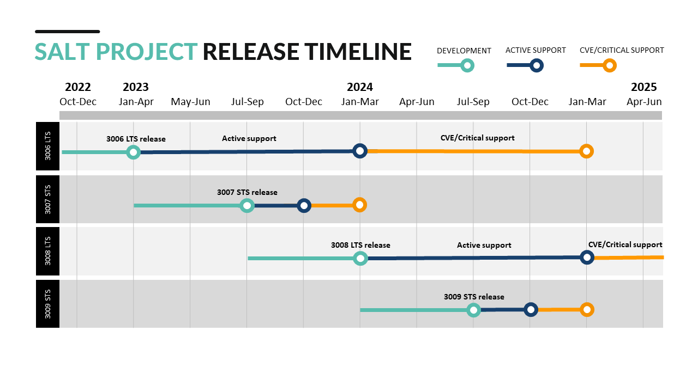

- Start Date: 2022-04-20
- SEP Status: Final Comment
- SEP PR: (leave this empty)
- Salt Issue: (leave this empty)

# Summary
[summary]: #summary

The core team would like to move to an LTS release strategy

# Motivation
[motivation]: #motivation

Our current release strategy causes us to provide security and bugfixes for as
many as five versions. Our documented [life cycle](https://docs.saltproject.io/salt/install-guide/en/latest/topics/salt-version-support-lifecycle.html#salt-version-support-lifecycle) has become less
sustainable as we've increased the frequency of releasing new versions of Salt.

# Design
[design]: #detailed-design

We would like to move to maintaining at most two branches/versions of Salt. We
can accomplish this by designating a single version as Long Term Support (LTS).
A LTS version would be supported with bugfixes and security fixes for a longer
period of time than our current life cycle allows. I propose a 2 year LTS window.

## Alternatives
[alternatives]: #alternatives

Change the current life cycle to provide support for less versions and/or for a shorter duration per version.

## Unresolved questions
[unresolved]: #unresolved-questions

- One big question is how long does an LTS version remain supported? I propose a
2 year support cycle but I could see a case made for 3 years.

- At what point do we stop supporting OSes that have reached end-of-life status for the LTS version?

@dmurphy18: I would propose that we stop support as now for OS's which have EOL'd on the LTS Release,
- reasoning being if the OS is not providing FREE security fixes, we should not
  either. PAID support for security fixes is another matter and between
  customer and VMware, not the Salt Project.
- non-LTS branch - does it get security fixes or do they come in the next
  release ?, if we could get releases done quicker than what we have now, I
  would go with next release.  If we cannot improve release cycle time, then
  guess we would have to provide them for non-LTS branch with a minor revision
  bump

# Drawbacks
[drawbacks]: #drawbacks

I think the core team all agrees this is the best path forward. I'm looking
forward to hearing what drawbacks the broader community can come up with.
