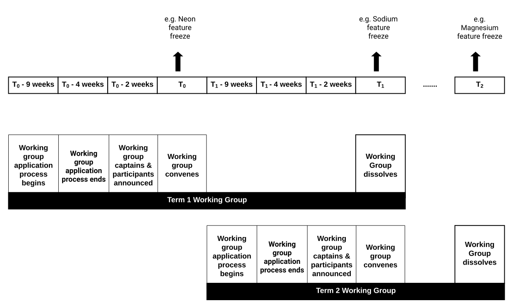

- Feature Name: Working Group
- Start Date: 2019-05-16
- SEP Status: Accepted
- SEP PR: https://github.com/saltstack/salt-enhancement-proposals/pull/12
- Salt Issue: (leave this empty)

# Summary
[summary]: #summary

Engage with the Salt community to get feedback on working groups 

# Motivation
[motivation]: #motivation

Salt's first working groups will convene by mid-June 2019. In order to benefit the participants of current and future working groups as well as those administering them, all working group details will be added as a README document in the repo `saltstack/community`. 

# Working Groups 

A Working Group is a small group of individuals who come together with a common goal and work towards achieving that goal within a predetermined amount of time. It’s an opportunity for the Salt community to lead Salt projects and be part of the process in its entirety. 

## Eligibility to participate 

Salt community members are eligible to be part of a working group if they have exhibited interest in working on the Salt project by raising either 1 or more PR(s), issue(s) or SEP(s) (Salt Enhancement Proposal).

In addition, a working group applicant is a Subject Matter Expert (SME) in areas such as Windows, Cloud, Networking or SSH 

If you want to lead or be part of a different working group then the ones mentioned above, Salt would be happy to include that as part of initial working groups, provided Salt receives enough interest from others to participate. 

## Application Process

Salt community members indicate their interest to be part of one or more working group(s) by filling out an application consisting of simple 4-5 question survey; Applicants indicate their preference for the type of working group(s) they want to join and the role they want to play: Captain or facilitator. If an application is received past the due date then the applicant will automatically be considered for the next term of the working groups. 

## Election 

Salt will conduct an election to choose the working group members in the following scenarios: 
- When the number of applicants interested in joining the working groups exceeds the number that is ideal for a working group (3 to 9 members) 
- 2 or more community members indicate their interest in being captain
- If Salt doesn’t receive any eligible applicants for captain role, a member of the Salt open/core will be elected to be captain of that working group. 

The rules for the election process are:  
- Election for the first working group captain will be internal and voting will be done by the Salt core team. 
- Elections for all subsequent working group captains and members will be voted on by the outgoing members of the current working group and Salt core team. 
- In the event of a tie, [Thomas Hatch](https://github.com/thatch45), Salt project creator, will make the final decision. 

## Timelines 

Based on the applications submitted, Salt chooses the final working group members 

Below is the approximate timeline for how long each working group term will last. The actual timeline may differ. For example, the Testing and Release Working Group might decide to convene immediately after a major release and dissolve after the next major release. 

*T0 is feature freeze date of current major release
 T1 is feature freeze date of next major release

## Collaboration 
Working Groups will meet not less than once a month for 60 mins. The monthly meetings which are set by SaltStack will be recorded and uploaded on Youtube. Meetings are not just restricted to the Working group members and can be attended by any Salt community members. Details of the meeting will be published in the individual working group github page; For example, for Testing working group meeting [check here](https://github.com/saltstack/community/tree/master/working_groups/wg-Testing)  

Below are some guidelines for working group participants, although each of these groups may operate a little differently depending on their needs and workflow.

## Working Group Structure  

Each member of a working group will fill one of 3 roles: captain, participant or facilitator. 

### Captain

Each working group captain will help lead their respective working group. 

#### Role of Captains
- The captain helps shepherd a subset of features/critical fixes for a given release
- The captain will help coordinate other contributors' work in their area
- The captain will attend monthly working group meetings for their respective working group. SaltStack will set these up, but SaltStack will hold no restriction on any additional meetings the captain may deem necessary

#### Captain Guidelines

- The captain will have merge rights to Salt repository
- A captain of one working group cannot be captain of any other Salt working groups. But the captain can be a participant of other Salt working groups 
- The captain can nominate the captain and/or participants of next term working group
- Captains are limited to 3 successive terms. Captains must take a break after their 3rd successive term. Following the break, they may come back to fill the role of captain again.
- Starting from 2nd term working groups, the captains chosen need to have been a participant in at least one working group 
- Once a captain’s term ends and they are no longer captaining the next term, their merge rights will be rescinded and transferred to the new captain of the working group 
- Single review completed by the captain on the PR will be considered as criteria met to merge the PR (No additional reviews required)
- The captain must follow the [Merge Guidelines](https://github.com/saltstack/salt-enhancement-proposals/); This is to ensure the Salt project grows responsibly. 
- In rare occasions and in consultation with the Salt Core team, the captain can nominate a vice-captain for the working group, to help assist during a leave of absence or to share responsibilities. The captain can also give merge access to said vice-captain of their working group while ensuring they follow the Merging Guidelines.

 
### Participant

Participants form the core of each of the working groups. 

#### Role of Participant 
- Participants will attend monthly working group meetings for their respective working group 
- Participants will get to work on exciting Salt projects: enhancements or issues that impacts thousands of Salt users

#### Participant Guidelines 
- No restriction on the number of working groups a participant can be part of 
- Once their term ends, a participant can move to a different working group or continue in the same working group 
- No term limits on how many times a Salt community member can be a participant of a working group 
- Participants don’t have merge rights. However in rare circumstances, the captain can recommend that a participant be granted merge rights.

### Facilitator 

Until the working groups mature, Saltstack will facilitate the working group meetings and there will be at least 1 SaltStack facilitator in every working group meeting

#### Role of Facilitator 
- The facilitator will work with the Salt core team to identify the list of participants, communicate/invite them to the working groups 
- The facilitator will ensure everyone gets a chance to voice their opinions
- The facilitator will ensure members adhere to the goals of the meeting and that the meeting doesn't devolve into tangential conversations 
- The facilitator sets up the monthly working group meetings and invites the appropriate participants
- The facilitator makes the agenda clear before every meeting
- The facilitator takes notes and shares the action items after every meeting 
- The facilitator ensures the working group members needs/interests are met 

## Benefits of Working Group 

- Active voice and participation in Salt projects 
- SaltStack will publish the efforts of working groups to the broader Salt community 
- SaltStack will recognize working groups members in various public platforms. 
- Participants and Captains will receive dedicated working group swag

