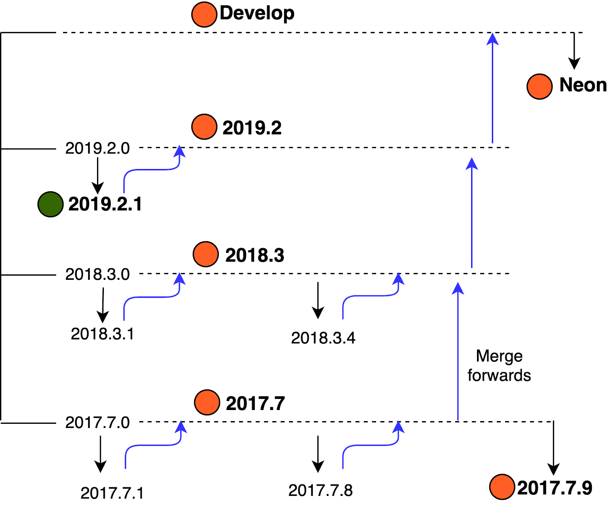

- Feature Name: Improved Salt Testing and Release Strategy
- Start Date: 2019-10-01
- SEP Status: Approved
- SEP PR: https://github.com/saltstack/salt-enhancement-proposals/pull/20

# Summary
[summary]: #summary

The purpose of this SEP is to define an overhaul of the Salt test, development, and release process. Also, read [the FAQ](https://docs.google.com/document/d/1DfOGVmsQaqr3rZrFqo-gf9wm1mYM-nwa5a1zROatCXQ/edit#heading=h.8yucbt63lrhh) after reading this SEP.

# Motivation
[motivation]: #motivation

Over the course of time, Salt releases have gotten increasingly complex and release timelines have become unpredictable and unstable. As the Salt core team spent a tremendous effort to stabilize the test suite for the 2019.2.1 release, a large number of problems became apparent and were identified as release issues.

- Missed releases.
- No clear indication to Salt users about which features/fixes are part of which releases.
- Overhead of maintaining 7 branches (untenable/not a good long-term strategy).
- Reduced release quality.

We have missed release deadlines due to the complexity of the Salt release process. Prior to the 2019.2.1 release we were maintaining **seven** branches:

- `develop`
- `neon`
- `2019.2.1`
- `2019.2`
- `2018.3`
- `2017.7`
- `2017.7.9`

The combination of bugfixes, merge forwards, and backports has been difficult to try and keep track of. There have been a number of Salt releases the community has met with confusion - why is this bugfix missing? Why was that feature added in a point release?

It’s also been difficult for the community to contribute, raising questions such as:

- If I want my changes in the next Salt release, what branch should I make my PR against?
- How should I be testing?
 
 In some cases contributors submitted their PRs only against the branch they cared about, and it was up to the Core team to ensure that these fixes or features made it to the other releases. This constantly shifting target produced a number of bugs. With a desire to merge PRs quickly to get fixes and features in, PRs were merged without tests, or with apparently unrelated test failures. When it came time for release, a tremendous amount of effort was required to fix failing tests and stabilize each branch. It was also difficult trying to ensure that all of the desired fixes, merge forwards, and backports were made before release.

During the 2019.2.1 release process it became apparent that our current approach is unsustainable and unacceptable. Our unique release process causes difficulty for contributors, is painful for users, and is impossible for maintainers.

**There must be a better way.**

The Salt core team has spent a tremendous amount of time, thought, and effort working to identify the issues that face our community and coming up with a plan for reducing the overhead and complexity to make it easier for Salt contributors to produce and ship high-quality software on time and to meet expectations. This proposal is the result of that process. 

These changes are intended to:

- Improve core Salt stability.
- Improve testing quality.
- Reduce maintenance and testing overhead.
- Be able to release Salt on demand.
- Be able to announce Salt release dates with a high degree of certainty.
- Maintain a **high-frequency, reliable release cadence of stable software**.

# Design
[design]: #detailed-design

## Single Branch Release Strategy

To eliminate the biggest source of confusion and distraction, Salt will adopt the industry standard of a **single branch release** strategy. Salt will have a **master** branch that reflects production-ready code. This will avoid the confusion and overhead of which branch needs to be merged where. This will also allow Salt contributors to spend more time focusing on bug fixes and new features that are important to Salt users.

### New master branch

A new branch, called **master** will be created from **2019.2.1**. Salt core team has spent close to 5 months stabilizing the 2019.2.1 branch. Because 2019.2.1 is stable and tests are already green, rather than repeating the entire process for **develop** or some other branch, PRs from `develop` and `neon` branches will be merged in a controlled manner to ensure **master** (formerly 2019.2.1) continues to stay stable and green.

**Focusing on a single release branch will help us to release better software more often**. In order to maintain this focus, and to meet our desired release cadence **there will be no more point releases on 2017.7.x and 2018.3.x branches and 2017.7.8 and 2018.3.4 will be capstone releases**.

### Tests Must Be Green

The Salt core team has already been requesting regression tests for bug fixes, and appropriate quality test suites to accompany new features. The entire test suite runs for each PR and **MUST** pass before merge, as [outlined in SEP 10](https://github.com/saltstack/salt-enhancement-proposals/blob/master/accepted/0010-pr-merge-requirements.md). Not only must new tests be passing, but if a failure in existing tests is exposed, the Salt core team will fix the test suite before any new PRs are merged. This will produce a higher degree of certainty that the code that we release is stable, and that changes to Salt code do not introduce regressions.

### PR Migration plan

Any changes previously added to the 2017.7 and 2018.3 branches will be merged forward into the new master branch. Also there are currently about 1,000 PRs that have been merged into the 2019.2, neon, and develop branches which will get merged into **master**, but it’s going to take a lot of work. The Salt core team has prioritized these PRs in terms of criticality to the Salt community, and ease of migration. The Salt core team is carefully working to port these PRs into the new **master**, and has reached out to many of the top contributors with a large number of PRs to explain and review our plans.

While the Salt core team has committed to migrate the PRs, because of the huge size of the task before us, we would love your help! If you have a PR that you’d like to get merged more quickly, we’d love your help migrating PRs from other branches to **master**.

## Release Cadence

The Salt team has a goal to be able to release when necessary. Our plan is to have a typical release cadence of 3 months. We expect to have an intermediate release cadence of 4 months. To be able release on demand, the Salt open team needs to:

- Always maintain green tests for release branch. 
- Ensure stability of release branch all the time.
- Adopt a 100% automated CI/CD release model.

The Salt core team has a goal to be on a 4 month release cadence for the next few releases, with the ultimate goal of being able to release whenever needed. While we plan to stabilize on a 3-month typical release cadence, the fact of software development is that it’s done by people, and people are imperfect and will make mistakes. To be able to minimize the impact of these mistakes it’s important to be able to quickly (but carefully) test and release bugfix versions to Salt, likely resulting in more frequent, smaller releases.

The Salt core team will be opening and merging PRs from develop and neon to **master** (based off 2019.2.1) as soon as this SEP is published to demo how the core team will handle the PR migration process.

## Hotfix / Patch Release

Despite our best efforts, we will likely still encounter bugs after release during this transition. To reduce the impact of these bugs **master** will stay in a feature freeze for 2 weeks after release, in order to fix bugs that were not encountered until after release.

The Salt core team will focus on these bugs, but quality bug fixes submitted by the community that are properly tested and documented may also be accepted during this period.

After **master** is able to have new features merged, if new, severe bugs without a workaround are reported, a short-lived hotfix branch may be created. This would be an issue that:

- Affects core Salt functionality.
- Has no workaround (i.e. requires a code change).
- Has a reasonably quick turnaround (the fix doesn’t require a serious refactoring).

This branch will go through our release process - testing in the CI/CD pipeline, manual tests, RC, and release. This branch will then be merged into **master**.

## Automation

To support the CI/CD approach, the Salt core team will be improving the automation of the deployment pipeline, with the goal of automatically producing nightly (or weekly) builds that flow through the entire build pipeline, including automated tests.

Other automation steps will be introduced to reduce friction for Salt community contributors. Documentation will be rewritten, published, and shared as necessary to remove as many blockers to contribution as possible.

## Documentation

One major challenge for the community is understanding changes coming in the next release. Focusing efforts on a single branch will help with this, but additionally Salt will create a changelog file to be updated by contributors, that will be used to document changes in a human-readable way, as specified in [SEP 1](https://github.com/saltstack/salt-enhancement-proposals/blob/master/accepted/0001-changelog-format.md). Updating this documentation will be required as part of the merge process - either from the contributor or by a Salt core team member.

Salt [documentation](https://docs.saltstack.com) will be updated to point to the most current release (2019.2.1 at the time of this writing). For users who have not yet upgraded, or those who are testing the unreleased version of Salt, Salt take an approach similar to the official Python documentation, and have a drop-down or some other way to easily select documentation for other Salt versions.

We will also upgrade our communication processes to keep the Salt community more aware of the release timelines. We will share progress with the [#salt channel on IRC on Freenode](http://webchat.freenode.net/?channels=salt&uio=Mj10cnVlJjk9dHJ1ZSYxMD10cnVl83), the #release channel in the [SaltStack Community Slack](https://saltstackcommunity.herokuapp.com/), and the [Salt Users mailing list](https://groups.google.com/forum/#!forum/salt-users).

## Versioning (Naming)

With the `neon` release, to indicate the new change in release process, Salt will change to a new, non-date based version schema beginning at 3000. The version will be MAJOR.PATCH. For a planned release containing features and/or bug fixes the MAJOR version will be incremented. 
 
With the increased release cadence in order to allow proper planning for feature deprecation, Salt will introduce a minimum 1-year, expected 3 major release cycle. If `neon` ships in January 2020, any new deprecations will not be removed until January 2021 at the earliest.

Note that this only applies to deprecations within Salt’s control. If a 3rd party changes, Salt may release updates earlier.

## Support matrix 

To be able to focus on the stability and innovation in the Salt platform, we will be adopting the industry-standard approach of no longer supporting older releases. Salt will provide select support for serious bugs and CVEs for the most recent release. Minor bug fixes will be targeted in the next scheduled Salt release.

## Alternatives
[alternatives]: #alternatives

The primary alternative is to keep doing the things that Salt has been doing, and try to make incremental changes. The costs (both opportunity and real) are no longer acceptable.

Long and unpredictable release times, unstable branches, missing (or extra) fixes and features, and regressions are all problems with our existing workflow. Trying to fix these problems here and there will not make the huge positive impact for our community that we are trying to make.

## Unresolved questions
[unresolved]: #unresolved-questions

Hopefully all the questions have been answered in this SEP. Upgrading Salt should continue to work like it always has - our changes are focused on the external development process of Salt. If you feel like you have unanswered questions, please come ask them at the Salt Office Hours on October 1st, 2019, or find us in [#salt on IRC on Freenode](http://webchat.freenode.net/?channels=salt&uio=Mj10cnVlJjk9dHJ1ZSYxMD10cnVl83), the [SaltStack Community Slack](https://saltstackcommunity.herokuapp.com/), or the [Salt Users mailing list](https://groups.google.com/forum/#!forum/salt-users).

# Drawbacks
[drawbacks]: #drawbacks

The Salt team recognizes that we have users and customers on older versions of Salt [outside their support windows](https://www.saltstack.com/product-support-lifecycle/). The Salt core team is working with support teams to carve out a plan to make the transition to supported Salt versions smoother.

There are also a *lot* of PRs that we need to migrate. However, this will probably not be much more difficult than the merge forward and backport process that we’ve been used to, though with the benefit that when we finish with this set of PRs we will never have to do it again. Fixes and features will be added to one single branch, and be available in the next scheduled release.
